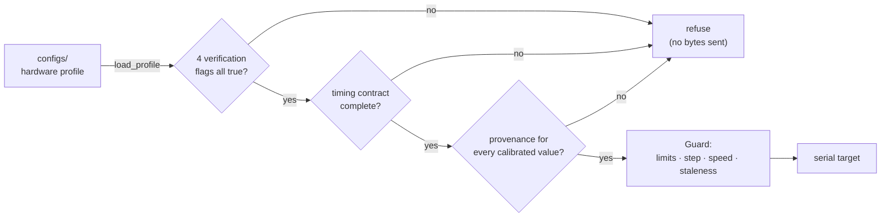
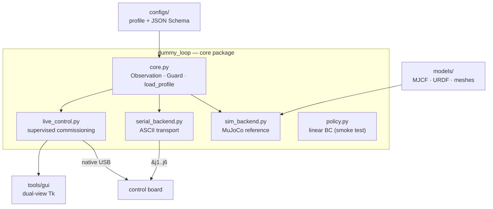

<div align="center">

# Dummy Arm Lab

**An evidence-graded control and simulation platform for the Dummy V2 six-axis arm.**

[](LICENSE)
[](https://www.python.org/)
[](https://mujoco.org/)
[](tests/)
[](docs/STATUS.md)

[English](README.md) · [中文](README.zh-CN.md) · [Status & Evidence](docs/STATUS.md) · [Roadmap](docs/plan/README.md)

</div>

---

## What this is

A working control stack for the [Dummy V2](https://github.com/peng-zhihui/Dummy-Robot)
desk robot arm, built toward vision-language-action research — with one unusual
property: **every claim in this repository is graded by how it was verified, and the
software refuses to move the hardware until the grading says it may.**

Most hobby robot repos tell you what they can do. This one also tells you what has
only been tested in software, what the firmware merely *reported*, and what a human
actually watched happen. Those are three different things, and conflating them is how
robot projects quietly produce unreproducible results.

## What this is not

Not a grasping policy. Not a VLA deployment. Not a calibrated dynamics model.
The learning pipeline currently in the repo is a **linear behaviour-cloning smoke test**
against a synthetic teacher — it exists to prove the data path works end to end, not to
solve a task. See [`docs/STATUS.md`](docs/STATUS.md) for the honest table.

---

## The evidence ladder

Every result carries a level. Nothing is allowed to be promoted without new evidence.

| Level | Meaning | Example from this repo |
| :---: | --- | --- |
| **L1** | Software test, no hardware attached | 49 unit tests; reference sim closes to 0.0022 rad |
| **L2** | Controller feedback reached target | Preset recheck: max feedback delta 0.006° |
| **L3** | Physically witnessed | Operator confirmed fold pose; emergency stop tested |

> **L2 is not L3.** Firmware reporting that it arrived and the machine actually being
> there are different claims. The controller readout is not end-effector accuracy.

---

## Safety model

The interesting part of this codebase is what it *refuses* to do.



Concretely:

- **A profile is an authorisation, not just parameters.** `core.load_profile` rejects the
  file unless calibration, software stop, *physical* stop and command mode are each
  independently marked verified — with a non-empty pointer to the experiment that
  verified them.
- **You cannot mark a profile calibrated without saying where the numbers came from.**
  Every calibrated field needs a `provenance` entry with method, date and evidence path.
- **Timing honesty is enforced.** If the firmware cannot report per-axis sample time, the
  profile *must* record a measured latency upper bound. Host receive time is never
  allowed to masquerade as sensor sample time — that mismatch silently poisons imitation
  learning datasets.
- **Autonomous execution over the legacy USB path is hard-blocked.**
  `SerialRobot.send_action` raises, by design.
- A software stop acknowledgement is never treated as a physical stop.

The shipped `configs/hardware.unverified.json` fails to load. That is not a bug to fix —
it is the gate doing its job, and a unit test asserts it stays that way.

---

## Quickstart

Reference simulation only. Touches no hardware, needs no robot.

```bash
git clone https://github.com/sunjunbo70-lang/dummy-arm-lab.git
cd dummy-arm-lab

python -m venv .venv && . .venv/bin/activate      # Windows: .venv\Scripts\activate
pip install -r requirements/core.txt

python -m unittest discover -s tests              # 49 tests
python -m dummy_loop collect-sim --episodes 40 --seed 7 --output run/teacher.npz
python -m dummy_loop train      --dataset run/teacher.npz --output run/policy.npz
python -m dummy_loop run-sim    --policy  run/policy.npz  --steps 240 --log run/rollout.jsonl
```

Expected: joint-error norm falls `0.30822 → 0.0022264 rad` over 240 steps. That exact
pair of numbers is reproducible on any machine and is recorded in
[`experiments/`](experiments/).

Add `--viewer` for the MuJoCo window, or `pip install -r requirements/gui.txt` and run
`python tools/live_mujoco.py --offline` for the dual-view GUI with no robot attached.

> No Git LFS needed — every asset in this repository is a plain git object. LFS should
> be enabled if large or frequently-changed binaries are introduced later; the exact
> migration commands are in `.gitattributes`.

---

## Architecture



| Unit | Responsibility |
| --- | --- |
| `dummy_loop/core.py` | Observation type, angle/shape validation, `Guard`, profile gate |
| `dummy_loop/serial_backend.py` | ASCII protocol, raw TX/RX logging, autonomous execution blocked |
| `dummy_loop/live_control.py` | Single owning worker thread, native feedback, slew limiting, presets |
| `dummy_loop/sim_backend.py` | MuJoCo reference model behind the shared robot interface |
| `dummy_loop/policy.py` | Synthetic teacher + linear behaviour cloning — explicitly not VLA |
| `configs/schema/` | JSON Schema the profile is validated against |
| `vendor/native_client/` | Fibre USB transport with this project's timeout fix |

**Units and frames.** Core API and reference policy use radians; the firmware speaks
degrees. Studio visual model displays `qpos = deg2rad(firmware_deg - [0,0,90,0,0,0])`;
native `joint.angle` needs offset `[0,-75,180,0,0,0]`. Never treat MuJoCo `qpos` as a
hardware angle — see [`docs/ARCHITECTURE.md`](docs/ARCHITECTURE.md).

---

## Current status

| Area | State | Level |
| --- | --- | :---: |
| Reference sim → linear BC → closed loop | Passing | L1 |
| Windows position commands + native USB feedback | Working | L2 |
| Physical J1 motion, fold pose | Operator confirmed | L3 |
| Per-axis calibration (sign, zero, limits) | **Not done** | — |
| Feedback freshness contract | **Not done** | — |
| Gripper · depth camera · Ubuntu · multi-GPU | Not deployed | — |

Full table with evidence links: [`docs/STATUS.md`](docs/STATUS.md).

### Roadmap

`M0` workspace baseline ✅ → `M1` profile schema v2 ✅ → `M2` read-only link &
timing contract → `M3` per-axis calibration → `M4` unified robot API →
`M6` fixed-mount RealSense → `M5` gripper → `M7` episode recorder + ACT.

Task cards with acceptance criteria live in [`docs/plan/`](docs/plan/).

---

## Repository layout

```text
dummy_loop/      core package — control, simulation, safety, reference policy
configs/         device profiles + JSON Schema (profile = authorisation)
models/          MJCF, URDF, meshes, provenance manifests
tools/           gui · simulation · modeling · hardware · diagnostics · maintenance
tests/           49 tests; hardware-dependent ones skip cleanly
docs/            architecture · status · hardware protocol · plan · data conventions
experiments/     frozen evidence with SHA-256 manifests, failures kept alongside successes
vendor/          Fibre native USB client with this project's timeout fix
```

Conventions worth reading before contributing:
[`AGENTS.md`](AGENTS.md) (safety boundaries and session protocol),
[`docs/DATA_FILES.md`](docs/DATA_FILES.md) (why there are so many JSON files and why
they must not be merged), [`docs/EXPERIMENTS.md`](docs/EXPERIMENTS.md).

---

## Hardware

Dummy V2, six axes, USB serial at 115200 with CRLF framing, plus a native Fibre USB
interface for angle feedback. Device identity is configured in
`configs/device_identity.json` — change it there, not in source.

Command protocol reference: [`docs/hardware/USB_COMMAND_PROTOCOL.md`](docs/hardware/USB_COMMAND_PROTOCOL.md).
Operating boundaries: [`docs/HARDWARE.md`](docs/HARDWARE.md).

> Do not run the original DummyStudio and this host software on the same serial port
> simultaneously. A protocol-level `ok` means queued or acknowledged — never arrival.

---

## Licence and third-party material

GPL-3.0, inherited from [`switchpi/dummy`](https://github.com/switchpi/dummy) whose
reference model and firmware this project builds on. See [`LICENSE`](LICENSE).

Assets extracted from DummyStudio are **not redistributed** here — the upstream
repository carries no licence declaration. What ships instead is the extraction script,
the assembly description and per-part SHA-256 manifests, so anyone holding their own
DummyStudio copy can rebuild byte-identical meshes and verify them. Details and the
full source table: [`THIRD_PARTY.md`](THIRD_PARTY.md).

## Contributing

Issues and PRs welcome. Please read [`CONTRIBUTING.md`](CONTRIBUTING.md) first — in
particular the rule that no change may upgrade a claim's evidence level without
attaching the experiment that earned it.
