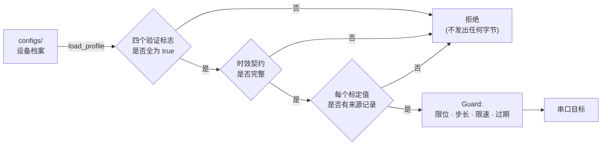

<div align="center">

# Dummy Arm Lab

**面向 Dummy V2 六轴机械臂的控制与仿真平台,每条结论都标注证据等级。**

[](LICENSE)
[](https://www.python.org/)
[](https://mujoco.org/)
[](tests/)
[](docs/STATUS.md)

[English](README.md) · [中文](README.zh-CN.md) · [状态与证据](docs/STATUS.md) · [路线图](docs/plan/README.md)

</div>

---

## 这是什么

面向 [Dummy V2](https://github.com/peng-zhihui/Dummy-Robot) 桌面机械臂的控制栈,
朝视觉-语言-动作方向推进。它有一个不太常见的性质:
**仓库里每条结论都标明了它是怎么被验证的,而且在标定完成之前,软件会拒绝驱动实机。**

多数机械臂项目告诉你它能做什么。这个项目还会告诉你哪些只在软件里测过、
哪些只是固件自己report到位、哪些是人真的看着发生的。这是三件不同的事,
把它们混为一谈正是机器人项目悄悄产出不可复现结果的方式。

## 这不是什么

不是抓取策略,不是 VLA 部署,不是标定过的动力学模型。
当前仓库里的学习管线是**针对合成教师的线性行为克隆冒烟测试** ——
它存在的意义是证明数据通路端到端可用,不是解决某个任务。
诚实的对照表见 [`docs/STATUS.md`](docs/STATUS.md)。

---

## 证据分级

每条结果都带等级,没有新证据不得升级。

| 等级 | 含义 | 本仓库中的例子 |
| :---: | --- | --- |
| **L1** | 软件测试,不接硬件 | 70 个单元测试;参考仿真收敛到 0.0022 rad |
| **L2** | 控制器反馈到位 | 预设复测最大反馈差 0.006° |
| **L3** | 实体验收 | 操作者确认折叠姿态;急停实测 |

> **L2 不是 L3。** 固件说自己到位,和机器真的在那个位置,是两个不同的声明。
> 控制器读数不是末端空间精度。

---

## 安全模型

这份代码里最值得看的部分,是它**拒绝**做什么。



具体来说:

- **档案是授权,不只是参数。** `core.load_profile` 要求标定、软件停止、
  **物理**急停、命令模式各自独立标为已验证,并且每一项都要指向验证它的实验记录,
  否则拒绝加载。
- **不说明数字来源就无法把档案标为已标定。** 每个标定字段都必须有
  `provenance` 记录,含方法、日期与证据路径。
- **时效诚实是强制的。** 固件给不出逐轴采样时刻时,档案**必须**写下实测的延迟上界。
  主机接收时刻永远不允许冒充传感器采样时刻 —— 这个错位会悄悄毁掉模仿学习数据集。
- **旧 USB 通路上的自主执行被硬性阻断。** `SerialRobot.send_action` 直接抛异常,
  这是设计意图。
- 软件停止的应答永远不被当作物理停止。

随仓库分发的 `configs/hardware.unverified.json` 加载必定失败。
这不是待修复的缺陷,是门禁在正常工作,并且有一个单元测试保证它保持这样。

---

## 快速开始

只跑参考仿真,不接触硬件,不需要机械臂。

```bash
git clone https://github.com/sunjunbo70-lang/dummy-arm-lab.git
cd dummy-arm-lab

python -m venv .venv && . .venv/bin/activate      # Windows: .venv\Scripts\activate
pip install -r requirements/core.txt

python -m unittest discover -s tests              # 70 个测试
python -m dummy_loop collect-sim --episodes 40 --seed 7 --output run/teacher.npz
python -m dummy_loop train      --dataset run/teacher.npz --output run/policy.npz
python -m dummy_loop run-sim    --policy  run/policy.npz  --steps 240 --log run/rollout.jsonl

# 墙面抹涂仿真链路（场景、末端控制、任务、示教、误差模型），见 docs/SIMULATION.md
python -m dummy_loop.wall demo --random-scale 1 --probe --servo
```

预期结果:240 步内关节误差范数从 `0.30822` 降到 `0.0022264 rad`。
这两个数字在任何机器上都可复现,并记录在 [`experiments/`](experiments/) 里。

加 `--viewer` 可打开 MuJoCo 窗口;
装 `requirements/gui.txt` 后运行 `python tools/live_mujoco.py --offline`
可在不接机械臂的情况下看双视图上位机。

> 不需要 Git LFS,仓库里所有资产都是普通 git 对象。
> 以后引入大体积或频繁改动的二进制文件时再启用,迁移命令写在 `.gitattributes` 里。

---

## 当前状态

| 方向 | 状态 | 等级 |
| --- | --- | :---: |
| 参考仿真 → 线性 BC → 闭环 | 通过 | L1 |
| Windows 位置指令 + 原生 USB 反馈 | 可用 | L2 |
| 实体 J1 运动、折叠姿态 | 操作者确认 | L3 |
| 逐轴标定(方向、零位、限位) | **未完成** | — |
| 反馈新鲜度契约 | **未完成** | — |
| 夹爪 · 深度相机 · Ubuntu · 多卡 | 未部署 | — |

带证据链接的完整表格见 [`docs/STATUS.md`](docs/STATUS.md)。

### 路线图

`M0` 工作区基线 ✅ → `M1` 档案 schema v2 ✅ → `M2` 只读链路与时效契约 →
`M3` 逐轴标定 → `M4` 统一 Robot API → `M6` 固定机位 RealSense →
`M5` 夹爪 → `M7` episode 采集器 + ACT。

带验收标准的任务卡在 [`docs/plan/`](docs/plan/)。

---

## 目录结构

```text
dummy_loop/      核心包 —— 控制、仿真、安全层、参考策略
configs/         设备档案与 JSON Schema（档案即授权）
models/          MJCF、URDF、网格、溯源清单
tools/           gui · simulation · modeling · hardware · diagnostics · maintenance
tests/           70 个测试；依赖硬件的用例会干净跳过
docs/            架构 · 状态 · 硬件协议 · 计划 · 数据约定
experiments/     带 SHA-256 清单的冻结证据，失败与成功记录同等保留
vendor/          Fibre 原生 USB 客户端，含本项目的超时修复
```

参与开发前值得先读:[`AGENTS.md`](AGENTS.md)(安全边界与会话协议)、
[`docs/DATA_FILES.md`](docs/DATA_FILES.md)(为什么有这么多 JSON 文件,
以及为什么它们不能合并)、[`docs/EXPERIMENTS.md`](docs/EXPERIMENTS.md)。

---

## 硬件

Dummy V2 六轴,USB 串口 115200、CRLF 分帧,另有用于角度反馈的原生 Fibre USB 接口。
设备身份配置在 `configs/device_identity.json`,换设备改那里,不要改源码。

命令协议:[`docs/hardware/USB_COMMAND_PROTOCOL.md`](docs/hardware/USB_COMMAND_PROTOCOL.md)。
操作边界:[`docs/HARDWARE.md`](docs/HARDWARE.md)。

> 不要让原版 DummyStudio 和本上位机同时占用串口。
> 协议层返回 `ok` 只代表入队或应答,不代表到位。

---

## 许可与第三方资料

GPL-3.0,继承自本项目所基于的
[`switchpi/dummy`](https://github.com/switchpi/dummy) 参考模型与固件。
见 [`LICENSE`](LICENSE)。

从 DummyStudio 提取的资产**不随本仓库分发** —— 上游仓库没有许可声明。
仓库中保留的是提取脚本、装配描述和逐部件 SHA-256 清单,
持有自己 DummyStudio 副本的人可据此重建字节一致的网格并自行校验。
完整来源表见 [`THIRD_PARTY.md`](THIRD_PARTY.md)。

## 参与贡献

欢迎 issue 和 PR。请先读 [`CONTRIBUTING.md`](CONTRIBUTING.md),
特别是这一条:任何改动都不得在没有附上相应实验记录的情况下提升某条结论的证据等级。
